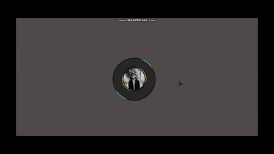

<!-- ──────────────────────────────────────────────────────────── -->
<!--  Profile Card – README                                      -->
<!-- ──────────────────────────────────────────────────────────── -->

<h1 align="center">
  💼 <strong>Profile&nbsp;Card</strong>
</h1>

<p align="center">
  A sleek, responsive personal‑profile card<br>
  built with <strong>HTML</strong> &amp; <strong>CSS</strong>.
</p>

<p align="center">
  <!-- GIF preview -->
  
</p>

---

## ✨ Features

- **Glassmorphism** & subtle hover effects  
- **100 % responsive**—looks sharp on phones, tablets & desktops  
- Pure **HTML / CSS** (no frameworks)  
- Easy to **customize** colors, fonts, social links & photo  

---

## 🛠️ Tech Stack

| Tech | Why |
|------|-----|
|  | Semantic markup |
|  | Layout & visual magic |

---

## 📂 Project Structure

```text
profieCard/
├── index.html         # Main demo page
├── style.css          # All styling
├── assets/
│   └── profile-card-preview.gif  # Preview GIF
└── README.md
